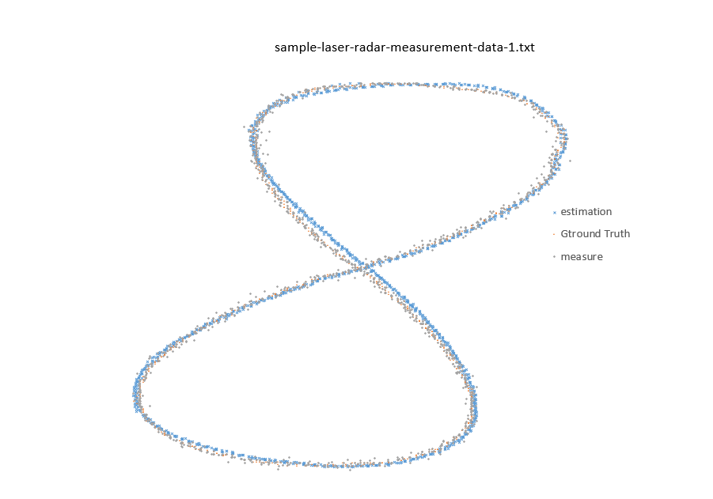
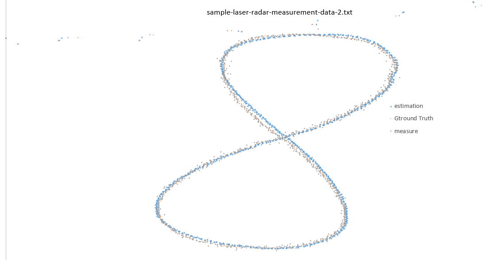

# Extended Kalman Filter Project Starter Code
This Project is the sixth task (Project 2 of Term 2) of the Udacity Self-Driving Car Nanodegree program. The main goal of the project is to apply Extended Kalman Filter to fuse data from LIDAR and Radar sensors of a self driving car using C++.

# Method: #

I have not been able to use the simulator due to communication problems between the simulator and win7/docker.

therefore I have used the old method of a text output, I have then used excel to review and analyse the results (file not attached due to size restriction).

note:
To run the code the Eigen library needs to be linked

# Results: #

## position first data set: ##

## position first data set: ##

## MSRE first data set##

Accuracy - RMSE:

px: 0.0758215

py: 0.0842188

vx: 0.632344

vy: 0.580668

## MSRE second data set##

Accuracy - RMSE:

px: 0.194559

py: 0.189894

vx: 0.518945

vy: 0.507547
